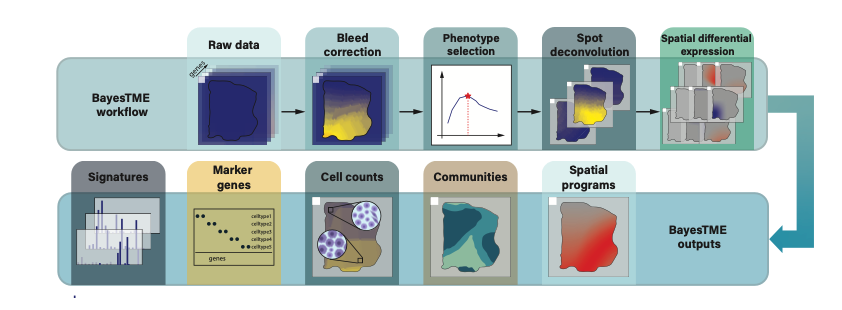

Overview
========

BayesTME is a holistic Bayesian approach to the end-to-end modeling of ST data.

Please see our `preprint <https://www.biorxiv.org/content/10.1101/2022.07.08.499377>`_

The figure below overviews the full BayesTME workflow and outputs:

It is expected that the end user will run these 4 steps in sequence on their sample,
but they can also be composed and mixed and matched. For example if bleeding correction
was not relevant or necessary, it could be skipped and the pipeline started at phenotype selection.
BayesTME aims to keep these four components modular to allow flexible workflows when necessary.

BayesTME provides a :ref:`command-line-interface` that can be used
to run each of the four steps, and subsequent creation of figures, but there are also main methods
for each step that can be called to run the steps in your own python script, IPython notebook, or
python based workflow manager.

If you use this package, please cite:

.. code::

    BayesTME: A unified statistical framework for spatial transcriptomics
    H. Zhang, M. V. Hunter, J. Chou, J. F. Quinn, M. Zhou, R. White, and W. Tansey
    bioRxiv 2022.07.08.499377.
