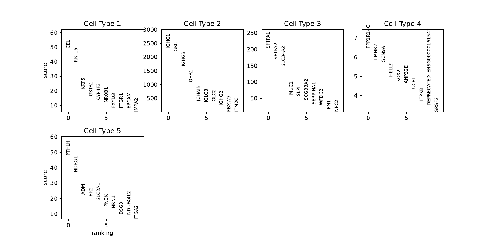

.. _nextflow:

Nextflow Pipeline
=================

BayesTME provides an end-to-end pipeline implemented in nextflow for running a basic analysis on a Visium 10x dataset.

The only requirements for running the BayesTME nextflow pipeline locally are to install nextflow
(https://www.nextflow.io/docs/latest/getstarted.html) and docker (or singularity).

.. code::

    nextflow run main.nf -profile docker --input <path to spaceranger output or .h5ad file> --n_cell_types 5 --outdir <output dir>

If you are providing a ``.h5ad`` file, make sure it has the correct input attributes: :ref:`anndata-input-format`

If you are providing a spaceranger output directory, we will create an AnnData h5ad from it.

The results will be in the ``outdir`` directory specified in the params file, and will include
data and plots.

For more complicated workflows, see `./nextflow/modules` and `./nextflow/subworkflows` for composable components
that can be reused to author new pipelines.

Output
======

When you run this nextflow command, you should see the following output on your terminal:

.. code::

    [18/aedf8d] BAY…UM_ANALYSIS:BAYESTME_LOAD_SPACERANGER (sample) | 1 of 1 ✔
    [11/123e74] BAY…VISIUM_ANALYSIS:BAYESTME_FILTER_GENES (sample) | 1 of 1 ✔
    [1b/91f87b] BAY…ISIUM_ANALYSIS:BAYESTME_DECONVOLUTION (sample) | 1 of 1 ✔
    [c8/49d777] BAY…STME_SPATIAL_TRANSCRIPTIONAL_PROGRAMS (sample) | 1 of 1 ✔

    Completed at: 12-Mar-2025 12:41:56
    Duration    : 13m 31s
    CPU hours   : 0.2
    Succeeded   : 4

You can then view the results directory, which will look like this:

.. code::

    .
    ├── pipeline_info
    │   ├── execution_report_2025-03-12_13-24-18.html # report of each step in the pipeline and the RAM/CPU/Time used
    │   ├── execution_timeline_2025-03-12_13-24-18.html
    │   └── pipeline_dag_2025-03-12_13-24-18.html
    ├── sample
    │   ├── dataset.h5ad # input anndata
    │   ├── dataset_deconvolved_marker_genes.h5ad # output anndata
    │   ├── dataset_filtered.h5ad # filtered anndata (with genes subsetted)
    │   ├── deconvolution_loss.pdf # deconvolution loss plot
    │   ├── deconvolution_samples.h5 # deconvolution samples
    │   ├── marker_genes.csv # marker gene ranking for all genes in all celltypes
    │   ├── omega.csv
    │   ├── plots
    │   │   ├── cell_num_one_vs_all_scatterpie__Cell Type 0.pdf # one vs all scatterpies
    │   │   ├── cell_num_one_vs_all_scatterpie__Cell Type 1.pdf
    │   │   ├── cell_num_one_vs_all_scatterpie__Cell Type 2.pdf
    │   │   ├── cell_num_one_vs_all_scatterpie__Cell Type 3.pdf
    │   │   ├── cell_num_one_vs_all_scatterpie__Cell Type 4.pdf
    │   │   ├── cell_num_scatterpie.pdf # scatterpie of deconvolved celltype contribution per spot
    │   │   ├── cell_type_counts.pdf # choropleth of cell type counts
    │   │   ├── cell_type_probabilities.pdf # choropleth of cell type probabilities
    │   │   ├── marker_genes.pdf # marker gene dotplot
    │   │   ├── rank_genes_groups.pdf # marker gene rank_genes_groups plot
    │   │   └── rank_genes_groups_sharey.pdf
    │   ├── relative_expression.csv
    │   ├── spatial_transcriptional_programs.h5 # stp samples
    │   ├── spot_connectivity_graph.pdf # plot of spot neighbor graph
    │   └── stp_plots
    │       ├── celltype0_program_0_top_5_genes.pdf # plot of top genes contributing to spatial program X
    │       ├── celltype0_program_1_top_5_genes.pdf
    │       ├── celltype0_program_2_top_5_genes.pdf
    │       ├── celltype0_program_3_top_5_genes.pdf
    │       ├── celltype0_program_4_top_5_genes.pdf
    │       ├── celltype0_stp.pdf # plot of spatial program X
    │       ├── celltype1_program_0_top_5_genes.pdf
    │       ├── celltype1_program_1_top_5_genes.pdf
    │       ├── celltype1_program_2_top_5_genes.pdf
    │       ├── celltype1_program_3_top_5_genes.pdf
    │       ├── celltype1_program_4_top_5_genes.pdf
    │       ├── celltype1_stp.pdf
    │       ├── celltype2_program_0_top_5_genes.pdf
    │       ├── celltype2_program_1_top_5_genes.pdf
    │       ├── celltype2_program_2_top_5_genes.pdf
    │       ├── celltype2_program_3_top_5_genes.pdf
    │       ├── celltype2_program_4_top_5_genes.pdf
    │       ├── celltype2_stp.pdf
    │       ├── celltype3_program_0_top_5_genes.pdf
    │       ├── celltype3_program_1_top_5_genes.pdf
    │       ├── celltype3_program_2_top_5_genes.pdf
    │       ├── celltype3_program_3_top_5_genes.pdf
    │       ├── celltype3_program_4_top_5_genes.pdf
    │       ├── celltype3_stp.pdf
    │       ├── celltype4_program_0_top_5_genes.pdf
    │       ├── celltype4_program_1_top_5_genes.pdf
    │       ├── celltype4_program_2_top_5_genes.pdf
    │       ├── celltype4_program_3_top_5_genes.pdf
    │       ├── celltype4_program_4_top_5_genes.pdf
    │       ├── celltype4_stp.pdf
    │       └── stp_loss.pdf
    └── versions.yml

Example Plots
=============

Here's some examples of what the plots will look like:

cell_num_scatterpie
~~~~~~~~~~~~~~~~~~~

cell_type_counts
~~~~~~~~~~~~~~~~

cell_type_probabilities
~~~~~~~~~~~~~~~~~~~~~~~

marker_genes
~~~~~~~~~~~~

rank_genes_groups
~~~~~~~~~~~~~~~~

stp program
~~~~~~~~~~~

stp top genes
~~~~~~~~~~~~~

